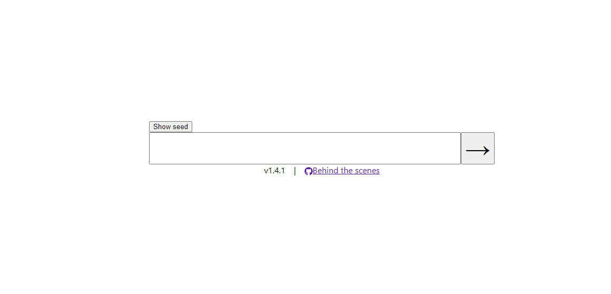

#  Word Guess

A rapid-fire word game designed to teach players about different linguistic traits of their language and algorithms like binary search.  

In this game, you guess the word letter-by-letter and are told if the actual letter is before or after the letter you guessed, if you guess the same letter incorrectly a second time, you will see both an upper and lower bound of what the actual letter could be.

Currently, this game is focused on challenging friends & family. We're working on adding single player challenges.  

Enter your challenge and click "show seed", share this code with them and they won't know the answer.

## Contributions

Feel free to contribute or share ideas via [issues](https://github.com/j-m/word-guess/issues)  
Maintained by [@j-m](https://github.com/j-m)  

## Getting Started

To run the project locally, you will need [Nodejs](https://nodejs.org/en/download/) and `npm`.  
Then run `npm ci` and `npm start` and you're off!  
Take a look at our [issues](https://github.com/j-m/word-guess/issues) and [projects](https://github.com/j-m/word-guess/projects) to see if there's anything you'd like to help us with

## Roadmap

- Random challenge  
- Daily Challenge  
- Leaderboards  
- Compete mode  
