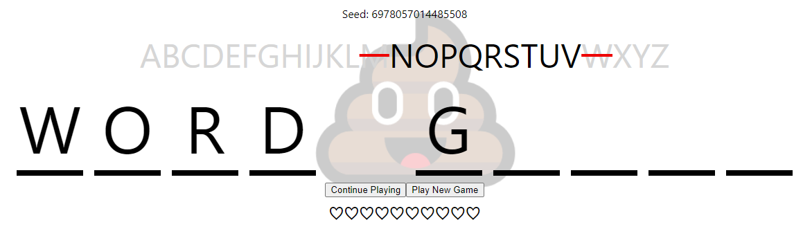

#  Word Guess

Hangman without the hanging man  

Built using ReactJS (overkill, I know)

## Contributions

Feel free to contribute or share ideas via issues  
Maintained by [@j-m](https://github.com/j-m)  

## Getting Started

To get the project running locally, you'll need [Nodejs](https://nodejs.org/en/download/) and `npm` (which comes with Nodejs)
Then simply run `npm i` and `npm start` and you're off!

## Roadmap

- Random challenge  
- Daily Challenge  
- Leaderboards  
- Compete mode  

## Wiki

[Changelog](./CHANGELOG.md)  
[Live deployment](https://j-m-word-guess.herokuapp.com/)  
